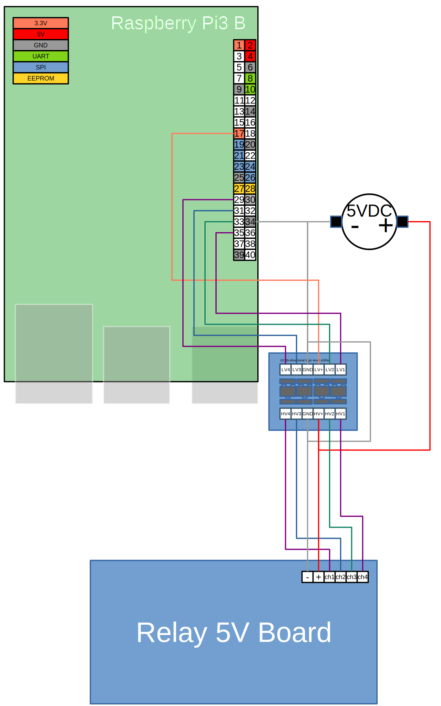
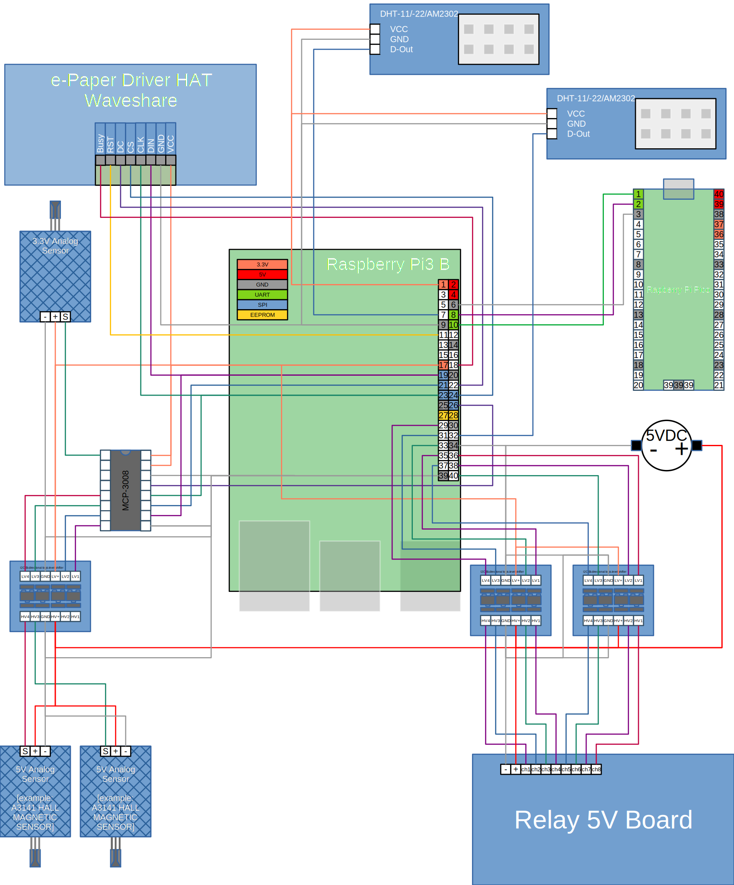

# Raspberry_SeRAPiS
---
**Se**nsor **R**elay **A**ction **Pi** **S**ystem <br />

---
This Project can get setup on one or more Raspberry Pi's to Collect and Display Sensor Data, and Switch Relays.<br />

Each Raspberry can perform on or more of the roles:

 - [Relays](README.md#Relays)
 - [Sensors](README.md#Sensors)
 - ~~[Display](README.md#Display)~~
 - ~~[Web-interface](README.md#Web-Interface)~~
 - [Database](README.md#Database)

Features:

 - Collecting sensor Data
 - Switch relays based on a daily routine

Planned Features:

 - Switch relays based on Sensor Data
 - Switch relays directly using json-rpc
 - use a Display to show latest Sensor Data
 - provide a Web-interface to:
   - Display Sensor-Data
   - Display and change Relay Rules
   - Change the Relay Situation directly

## Info
Realised on Debian ["wheezy" <5.10.103-v7+>]<br />
using:

 - SystemD
 - Python3
 - MariaDB

### Install Pyhton3 and pip3
```bash
$sudo apt update
$sudo apt upgrade
$sudo apt-get install python3 python3-pip
```

<br /><br />

---
---

## Relays
---
```
├── sys-rpi/
│   └── systemd/
│       └── SeRAPiS_Relay.service
│
├── myServiceRelays.py
│
├── config.ini
├── database.py
└── relay_rasp.py
```
### Python3 Relay necessary installs 
```bash
$sudo apt install python3-rpi.gpio
```
### SystemD Install Relay Service
```bash
$sudo cp ./sys-rpi/systemd/SeRAPiS_Relay.service /etc/systemd/system/SeRAPiS_Relay.service
$sudo systemctl start SeRAPiS_Relay.service
$sudo systemctl enable SeRAPiS_Relay.service
$sudo systemctl status SeRAPiS_Relay.service
```

config.ini
```ini
[Relay]
BCM-GPIO = [5,6,13,16]  #lists all BCM Pin numbers in order of chanel
activation_Situation = [0,0,0,0] #start situation of each chanel, 0 is switched off 1 is switched on
Updata-rate_in-sec = 2.4 #seconds between relay updates as float
```
### Rules
Behaviour gets configured using the Database<br />
Rulesets are grouped as Routines, and Special Events<br />
Routines include:

 - Table <[Relay_Routine](README.md#Relay_Routine)> 
 - Table <[Relay_Routine_day](README.md#Relay_Routine_day)>
 - Table <[Relay_Routine_hour](README.md#Relay_Routine_hour)>
 - ~~Table <[Relay_Routine_sensor](README.md#Relay_Routine_sensor)>~~

Special Events

 - ~~Table <[Relay_Special_Event](README.md#Relay_Special_Event)>~~

~~If Relay Database Logging is active every Situation change gets logged into the Database Table<[timeline_Relay](README.md#timeline_Relays)>~~

<br>

every Rule takes Relay Situation in consideration
|||
|---|---|
|1| Relay chanel gets Switched ON, if rule applys|
|0| Relay chanel gets Switched OFF, if rule applys|
|#| Relay chanel State will be ignored i.e. stays the same if rule applys|
|+| Relay chanel State has to be switched ON otherwise rule will be ignored|
|-| Relay chanel State has to be switched OFF otherwise rule will be ignored|
#### Example Rules

| Situation | Example Rule | Outcome |
|---|---|---|
|[0,0,0,0]|+\|1\|1\|1|[0,0,0,0]|
|[0,0,0,0]|-\|1\|1\|1|[0,1,1,1]|
|[0,0,0,0]|-\|1\|#\|0|[0,1,0,0]|
|[0,0,1,1]|-\|1\|#\|0|[0,1,1,0]|
### Example Setup using a 4 Chanel 5V Relay Board
#### Example Hardware


#### Example Config
```ini
[Relay]
BCM-GPIO = [5,6,13,19]  #lists all BCM Pin numbers in order of chanel
activation_Situation = [0,0,0,0] #start situation of each chanel, 0 is switched off 1 is switched on
Updata-rate_in-sec = 2.4 #seconds between relay updates as float

```
<br /><br />

---
---

## Sensors
---
```
├── sys-rpi/
│   └── systemd/
│       └── SeRAPiS_Sensor.service
├── sensors/
|   ├── _example_sensor_README.md
|   ├── _example_sensor.py
|   ├── dht_README.md
│   ├── dht.py
│   └── ...
|
├── myServiceSensors.py
│
├── config.ini
└── database.py
```

for every sensor configured into the config.ini a new Thread gets started<br />
new Sensors can get added without changing any code, but by adding a new lib to the /sensors Folder and adding its configuration to the config.ini <br />
###  SystemD Install Sensor Service 
```bash
$sudo cp ./sys-rpi/systemd/SeRAPiS_Sensor.service /etc/systemd/system/SeRAPiS_Sensor.service
$sudo systemctl start SeRAPiS_Sensor.service
$sudo systemctl enable SeRAPiS_Sensor.service
$sudo systemctl status SeRAPiS_Sensor.service
```

### config.ini
```ini
[Sensors]
json_Sensors = [
                {"chanel": 1,
                 "lib": "/dht.py",
                 "update_rate": 0.5,
                 "config": "{\"Sensor\": 11, \"BCM-GPIO\": 12}"},

                {"chanel": 2,
                 "lib": "/dht.py",
                 "update_rate": 10,
                 "config": "{\"Sensor\": 11, \"BCM-GPIO\": 27}"}]
```
new Sensors can get added to the json string<br>
every sensor has:
 - a unique integer as chanel identifier
 - the name of the used library file
 - the update rate in seconds
 - the config as described by the used sensor library

### new Sensors
should use [_example_sensor](sensors/_example_sensor_README.md) as blueprint
### existing Sensors
 - [DHT11 / DHT22 / AM2302](sensors/dht_README.md)
 - ~~[MCP3008 8-Channel 10-Bit A/D Converter](sensors/ADC_MCP3008_README.md)~~
<br /><br />

---
---

## Display
---
*not yet supported*

<br /><br />

---
---

## Web-Interface
---
*not yet supported*

<br /><br />

---
---

## Database
---
*not fully documented*<br />
Usin MariaDB <br />
### Install Database:
```console
$sudo apt-get ...
```
### Setup new Raspberry
```console
$sudo mysql db_name
SELECT User, Host FROM mysql.user WHERE Host <> 'localhost';
GRANT ALL PRIVILEGES ON *.* TO 'user'@'adress' IDENTIFIED BY 'password' WITH GRANT OPTION;
```
### Tables


#### Box

| ID | Name | Host | Relay_Ch_Names | Relay_Routine_id | Relay_logging |
|---|---|---|---|---|---|
| *int* | *string* | *string* | *string* | *int* | *Bool* |
|-|-|-|-|-|-|
|---|Box Name|network Address|Relay_chanel description|---|---|

#### Relay_Routine
| ID | Relay_Count | Name | UTC_update |
|---|---|---|---|
| *int* | *int*| *string* | *int* |

 <br /> <br />
'Relay_settings' describes a Rule <br />each Symbol Representing a Relay separate by '|' <br /> Symbols are:

|||
|--|--|
|1| Relay gets Switched ON, if rule applys|
|0| Relay gets Switched OFF, if rule applys|
|#| Relay State will be ignored i.e. stays the same if rule applys|
|+| Relay State has to be switched ON otherwise rule will be ignored|
|-| Relay State has to be switched OFF otherwise rule will be ignored|
||


#### Relay_Routine_day
| ID | Relay_Routine_id | daily_offset_sec | Relay_setting | info |
|---|---|---|---|---|
|*int* | *int* | *int* | *string* | *string* |
|-|-|-|-|-|
|||3600|0\|0\|0\|0|Example: <br />every Day at 1:00:00 UTC <br />all 4 Relays get switched OFF|
|||46800|1\|#\|+\|0|Example: <br />every Day at 13:00:00 UTC <br />if the 3rd Relay is Switched on <br />switch on 1st Relay <br /> adopt state of 2nd Relay <br />switch off 4th Relay

#### Relay_Routine_hour
| ID | Relay_Routine_id | hourly_offset_sec | Relay_seting | info |
|---|---|---|---|---|
|*int* | *int* | *int* | *string* | *string* |
|-|-|-|-|-|

#### Relay_Routine_sensor
| ID | Relay_Routine_id |
|---|---|
| *int* | *int* |
|-|-|
|||

#### Relay_Special_Event
| ID | Box_id | UTC_Event | Relay_seting | info |
|---|---|---|---|---|
| *int* | *int* | *int* | *string* | *string* |
|-|-|-|-|-|
|||1652802500|1\|#\|#\|#|on the 17. Mai 2022 at 15:48:20<br />Switch ON 1st Relay<br/>apodt the State of the other 3 Relays

#### Sensors
| ID | Box_ID | Chanel | Working | utilisation_counter | fst_use_UTC | Sensor_Type | info |
|---|---|---|---|---|---|---|---|
| *int* | *int* | *int* | *Bool* | *int* | *int* | *string* | *string* |
|-|-|-|-|-|-|-|-|
| - | - |1|True|1|1652802500|DHT22|DHT22 returning relative humidity and temperature|

#### timeline_Sensor
| ID | Sensor_ID | UTC | Type | Value |
|---|---|---|---|---|
| *int* | *int* | *int* | *string* | *double* |
|-|-|-|-|-|
| - | 1 | 1652802500 | temp | 22.4 |
| - | 1 | 1652802500 | rel_humid | 52.6 |

#### timeline_Relays
| ID | Box_ID | UTC | Situation |
|---|---|---|---|
| *int* | *int* | *int* | *string* |
|-|-|-|-|
||1|1652802500|0\|0\|0\|0|
||1|1652803000|1\|0\|0\|0|


## Sensor Rules

gets up to [count Sensor Data]

using [Reverse Polish notation](https://en.wikipedia.org/wiki/Reverse_Polish_notation)

| Command | Pops | Poped entrys| Description | example |
|---|---|---|---|---|
|'Data'|
|'loopData'|
|||
|'med'|0|```[]```|Calculates the Median from the Dataset|```[]```|
|'sum'|n+4|```[    ,'('    ,...{n entrys}...    ,')'    ,m    ,n    ]```|calculates the sum from entry m to entry n|```[]```|
|'prod'|n+4|```[    ,'('    ,...{n entrys}...    ,')'    ,m    ,n    ]```|Calculates the Produkt from entry m to entry n|```[]```|
|||||
|'+'|2|```[x,y]```||```[]```
|'-'|2|```[x,y]```||```[]```
|'*'|2|```[x,y]```||```[]```
|'/'|2|```[x,y]```||```[]```

## Example Setup

| Info | BCM | wPi | Name | Mode | V | Physical | Physical | V | Mode | Name | wPi | BCM | Info |
|:---|---:|---:|---:|---:|:---:|---:|:---|:---:|:---|:---|:---|---:|---:|
|DHT 22 | | | 3.3v | | | 1 | 2 | | | 5v | | | |           
| | 2 | 8 | SDA.1 | IN | 1 | 3 | 4 | | | 5v | | | |
| | 3 | 9 | SCL.1 | IN | 1 | 5 | 6 | | | 0v | | | |
| DHT 22 | 4 | 7 | GPIO. 7 | IN | 1 | 7 | 8 | 1 | ALT5 | TxD | 15 | 14 | UART->Pico |
| | | | 0v | | | 9 | 10 | 1 | IN | RxD | 16 | 15 | Pico->UART |
| ePaper | 17 | 0 | GPIO. 0 | OUT | 0 | 11 | 12 | 0 | IN | GPIO. 1 | 1 | 18 | |
| | 27 | 2 | GPIO. 2 | OUT | 0 | 13 | 14 | | | 0v | | | |
| | 22 | 3 | GPIO. 3 | IN | 0 | 15 | 16 | 0 | IN | GPIO. 4 | 4 | 23 | |
| ePaper | | | 3.3v | | | 17 | 18 | 0 | IN | GPIO. 5 | 5 | 24 | ePaper |
| ePaper | 10 | 12 | MOSI | ALT0 | 0 | 19 | 20 | | | 0v | | | |
| | 9 | 13 | MISO | ALT0 | 0 | 21 | 22 | 0 | OUT  | GPIO. 6 | 6 | 25 | ePaper |
| ePaper | 11 | 14 | SCLK | ALT0 | 0 | 23 | 24 | 1 | OUT | CE0 | 10 | 8 | ePaper |
| | | | 0v | | | 25 | 26 | 1 | OUT | CE1 | 11 | 7 | |
| | 0 | 30 | SDA.0 | IN | 1 | 27 | 28 | 1 | IN | SCL.0 | 31 | 1 | |
| Relay CH 1 | 5 | 21 | GPIO.21 | OUT | 1 | 29 | 30 | | | 0v | | | |
| Relay CH 2 | 6 | 22 | GPIO.22 | OUT | 1 | 31 | 32 | 0 | OUT  | GPIO.26 | 26 | 12 | dht22 2 |
| Relay CH 3 | 13 | 23 | GPIO.23 | OUT | 0 | 33 | 34 | | | 0v | | | |
| Relay CH 5 | 19 | 24 | GPIO.24 | OUT | 1 | 35 | 36 | 1 | OUT | GPIO.27 | 27 | 16 | Relay CH 4 |
| Relay CH 8 | 26 | 25 | GPIO.25 | OUT | 0 | 37 | 38 | 0 | OUT | GPIO.28 | 28 | 20 | Relay CH 6 |
| | | | 0v | | | 39 | 40 | 0 | OUT | GPIO.29 | 29 | 21 | Relay CH 7 |



